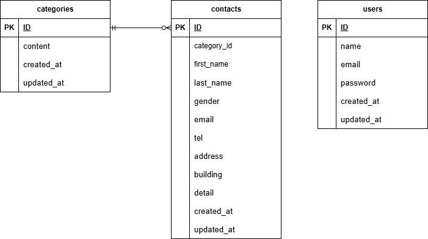

# お問い合わせフォーム
- ユーザーはお問い合わせフォームの入力、入力情報の確認、送信ができる
- 管理者は会員登録ページから会員登録ができる
- 管理者は管理画面でお問い合わせ内容一覧の確認、検索、削除、CSV出力ができる

## 環境構築


#### リポジトリをクローン

```
git clone git@github.com:urbexsaku/contact-form-test.git
```

#### Laravelのビルド

```
docker compose up -d --build
```

#### Laravel パッケージのダウンロード

```
docker compose exec php bash
```

```
composer install
```

#### .env ファイルの作成

```
cp .env.example .env
```

#### .env ファイルの修正

```
// 前略

DB_CONNECTION=mysql
DB_HOST=mysql
DB_DATABASE=laravel_db
DB_USERNAME=laravel_user
DB_PASSWORD=laravel_pass

// 後略
```

#### キー生成

```
php artisan key:generate
```

#### マイグレーション・シーディングを実行

```
php artisan migrate
```

```
php artisan db:seed
```

## 使用技術（実行環境）

フレームワーク：Laravel 8.75

言語：php 8.1

Webサーバー：nginx 1.21.1

データベース：mysql 8.0.26

## ER図



## URL

アプリケーション：http://localhost/

管理画面：http://localhost/admin

phpMyAdmin：http://localhost:8080
